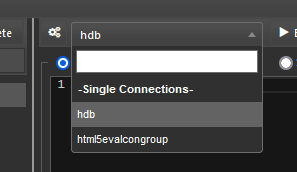
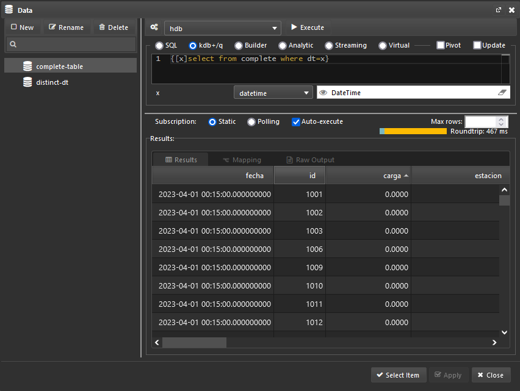

# KX Dashboards

## Steps to reproduce

In order to replicate the dashboard described on this post, all described on the [README file]().

---

## Chapter 1: Getting the gist of it

Thanks to the successful deployment of the kdb infrastructure discussed in our last post, Emma Monad, the CTO of Mad Flow, has decided to spend some time exploring the KX technology ecosystem more thoroughly. One of the tools that caught her attention the most was KX Dashboards. "This seems to be exactly what we need to replace those couple of processes written in Python that create some static graphics and automatically send them via email to our customers," she thought. Indeed, KX Dashboards would allow Emma to build dynamic reports based on the analytic data obtained from her processes and present them to her customers in a clean and interactive way, enabling them to gain more detailed insights into their data and information.

Emma has tasked our current protagonist, Félix Atomic, to build a dashboard to visualise Madrid's historic traffic using this new platform.  He has some background using other dashboard platforms, but he has mainly focused on developing software up until now, so this will mostly be a new experience to him. 

"Let's dive in, then." he thought, "This may be interesting!"

He started from the beginning: opening the URL his boss sent him. He was greeted by some examples prebuilt into the platform and decided to check them out, just to see what was possible. They were well built and varied in nature, but Félix focused on the ones that had maps, naturally. Since it was his first experience, he clicked around and eventually found the "Design" mode, where he could add new components and edit their properties. "Okay, I think I know where to begin..." he thought.

Messing around, he had also found the "New" and "Save" buttons on the top left, so he figured that in order to create a new dashboard that was the way to go, and he was right! After giving his dashboard a name, an empty grid appeared on screen with some icons on the left:

Instinctively, he dragged the first icon on the left to the grid and a box appeared that said "Click to **populate Data Source**"... "Yeah, that's what I want!" he thought, then clicked. A new window popped in front of him with lots of empty space and a few buttons highlighted:

"All right, not that many options available..." he decided to click on "New", trusting his intuition. This window updated itself, now with a few more options available. He knew from his boss that there was a connector already created to let him get the data from their historic database. Félix looked around and found the connector list "Ah, there it is, 'hdb'" he thought.

After selecting the connector he stopped on his tracks for a few minutes since he didn't really know what to do next. He knew the name of the table he was looking for. After all, he helped with the migration, but he didn't know how to access it from this screen.

He decided to check on the documentation in hopes of figuring out the next step and sure enough, not long after, he found [the data sources documentation](https://code.kx.com/dashboards/datasources/), where he found out exactly what were those connections he saw before (merely a connection handle like the ones you use after executing `hopen`) and then he learned that after selecting the connection he could just input some q code into the text box and get the results expected. "I got this" he thought, and simply wrote the name of the table he was after. After giving his data source a name and applying the changes he was happy to find out that his efforts paid off: he could see the data on screen!

---

## Chapter 2: Mental mapping

"This documentation is excellent!" Félix thought. It contained the answer to pretty much every question he had regarding this new platform he was using. He decided to check the documentation for the Map component, as it was the most likely candidate for this project he was assigned. After some thinking, he decided to build a heatmap of Madrid's traffic, since it aligned the data pretty nicely. He had the coordinates to the different measure points around the city and several values to show on the map, so it was a perfect fit!

And so he removed the data grid component he had previously worked so hard to make work and, with this new knowledge he had acquired, he dragged the Map component on the dashboard grid and started his journey.

After setting the Google Maps JavaScript API Key, he could actually see a map on screen! Sure, it wasn't Madrid, but he could move around and manually place himself where he needed to be and play around with the Map Type property to change how the map was displayed. "That was easy!" he thought.

Well, that felt easy for Félix. He had a feeling this was not going to last forever since he now had to populate the map with actual data.

He decided that, in order to test the waters, he should begin by using the data source he built for the table he previously had, so that became his starting point. He simply set that same data source as the one for the heatmap, set the longitude and latitude columns as the ones on the table and, lastly the "carga" column as the weight, since it contained the traffic density data.

"Nice!" he thought, "Easier than expected". However, as easy as it might have felt, the heatmap data was not the result he ultimately wanted. First off, he saw that the data source had a limit of 2000 rows retrieved by default and secondly, as cool as this may appear, he wanted to be able to see how the traffic evolved over time.

So Félix rushed to the documentation to see how he could fix those two issues. The first one was easy enough: he could change it right from the data source configuration screen, but the second one was a bit trickier to implement. After searching the documentation for a long while, he found this "Playback" component that would theoretically solve his issue by allowing him to set the value of a View State (whatever that was) and automatically update the Map component, linking both of them together.

That View State concept was the one key piece he was missing. After reading the documentation about it and learning that they were basically some sort of "global variable" that store information, he automatically started thinking of ways to introduce this feature into his dashboard. The main one was of course storing a datetime value to later (somehow) filter his data source but, as he later discovered, View States would become quite useful to him on many ways.

And so he placed his Playback component on the dashboard grid and started tinkering. He would need a couple of things: naturally a data source and a View State to store the specific value which he would use to filter later on. The first one was easy enough: he knew he could just use his qSQL knowledge to query the data and shape it however he wanted to. After removing the row limit and writing his query he was good to go.

Now he had to create a View State to store the selected datetime, and to do that he clicked on the "Selected Value" property of the Playback component and a new window popped up. Just as when he first started his journey, he trusted his instincts and clicked the "New" button on the top left. Félix was able to give his View State a name, a type and a value. After giving it the datetime type and naming it, he clicked "Select" and that was it! He had just created his first View State!

Now he just had to figure out how to filter his data source based on this parameter. This proved to be a hard task since the documentation only mentioned that you can write q code in the text box, but eventually after looking around online he found out that you can write a function on that text box and the arguments could be mapped to View States. Félix rushed to try it out and fair enough, he wasn't lied to!

After that, he saw the data update on screen. He hit the "play" button on the Playback component and...

Great! Exactly what he wanted. Now it was time to present this dashboard to Emma and see what she had to say about it.

---

## Chapter 3: Pedal to the metal

After meeting with Emma, Félix had some remaining tasks to complete. Emma praised the dashboard, mentioning that it looked fantastic, but she also had a few suggestions. Primarily, she wanted the user to have the ability to switch the information displayed on the heatmap. Additionally, she requested that the current datetime be shown as text on the heatmap. Lastly, she wanted a line graph to be plotted, comparing the average traffic data of the displayed day to the average weather measurement shown on the heatmap.

Félix started from what looked to be the easiest one of the tasks: showing the currently displayed datetime on screen. He dug into the documentation and found out there is a Text component that allows for custom text to be shown, so he dragged it on the grid to test it out and sure enough, the text he entered on the pop up that appeared after clicking "Formatted Text" was shown on the component, but he needed to show a value he had stored on a View State. After a short while, he found the "Template Text" pop up window, which conveniently showed the View States and after clicking on one of them, it placed itself on the text box, but it wasn't actually showing on the component. It was empty! It took Félix a while to find this out, but for any template text to be shown, there **must** be a data source linked, even if it's not used at all. In the end, the text he inputted to the template editor was `DateTime: {{[$DateTime$]}}` and he saw exactly what he expected:

Onto the second task: giving the user the ability to choose the information displayed on the heatmap.

Excited by the prospect of a quick win, he created a new data source with all the values the user should be able to choose from:

Then a view state to store the value:

And finally set those two things properly on the component's configuration. And there was that, now he had a dropdown menu that allowed him to choose what he wanted to see on the map!

Now he needed to apply this choice to the data shown on the heatmap. Since he already retrieved the entire table for a specific datetime, all he really needed to do was to change the "Weight" parameter of the heatmap to point to the "Measure" View State he just created

. With that out of the way, he was able to finish off this task, and the result looked great!

The last task looked a bit daunting at first. But since his experience had been pretty nice overall he trusted the platform and got straight into it. As has been usual lately, Félix went straight to the documentation to look for some component that may help him.

After looking around for a bit, he found the Canvas Chart component, which allowed him to plot all sorts of layered graphics. "Perfect!" he thought, "I just need to build a query that gets me the data the way I need it". Since he would need to get the average of both the "carga" column and  the chosen "Measure"  by time for a chosen day , he decided to dust off his functional qSQL skills and build a query that would do just that. He spent a short while remembering how it worked, but eventually he got it done.

His X axis would be the time column and there would be two layers: one for each of the other columns. Félix was able to quickly plot the "carga" column, since the default values provided on the component proved to be enough for now.

For the second layer, it was just as easy: select the same data source, the selected measure, this time as a View State and sure enough, he got it working first try!

Since he had some spare time because of how simple those three tasks turned out to be, Félix decided to mess around with the options available to him in order to make the dashboard that little bit more appealing. In the end, the dashboard looked like this:

It was exactly what he wanted: visually intuitive, yet feature-complete.

---

## Conclusion

KX Dashboards is an exceptionally well-designed platform that offers users, regardless of their technical expertise, a powerful tool to leverage their data effectively. Its primary strengths lie in its intuitive interface, although it might appear slightly overwhelming at first glance, and its comprehensive online documentation, which is consistently reliable.

Everything was where we expected it to be, and it seemed to follow the KISS principle quite nicely: you have a grid, components to fit in, a wide variety of configuration options for each one of them, and ways of connecting them together.

To make the most of KX Dashboards, it was crucial to understand the fundamental concepts of data sources and View States:

* Data sources are incredibly flexible because you can use q and qSQL queries to shape the source data however you want, essentially allowing you to preprocess it before plotting or displaying it on the screen.

* View States are a must if you want to connect components together, and once you grasp the concept, you'll find yourself using them everywhere. However, it's essential to be mindful as things can quickly get out of hand. Keeping them tidy and organized is crucial before it becomes too late.

Once those two key concepts were fully understood, the experience of using the platform became much more intuitive. 

For future projects, we see a couple of routes that seem particularly interesting: custom components and real-time data. Specifically, we wish for the ability to "link" multiple components together, assigning them all a single shared View State and being able to add more layers to our traffic heatmap. These could most likely be achieved by creating custom components. Regarding real-time data and streaming data sources, we see a perfect match to visualize and gain insights into them using KX Dashboards facilities. Stay tuned for more updates and exciting developments ahead!
